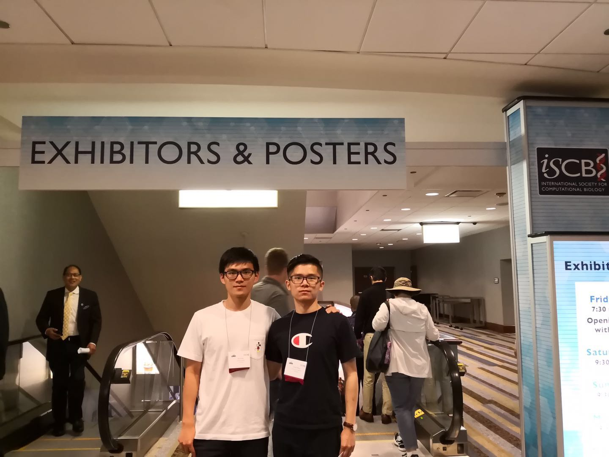

Birth Place: Shangrao, Jiangxi Province, China.  
Hometown: Shenzhen, Guangdong Province, China.  
Birth Year: 1994.  
{:class="img-responsive"}

	I prefer to be called Alex if you are not able to pronounce Mandarin. I come from Shenzhen, a modern city in the south of China. I enjoy hotpot, noodles, fried rice, bbq, .... hmm, all kinds of food. I play video games, watch movies and do road trips during my leisure time. 

	From the career perspective, I like researching computational biology, an interdiscpline involving computer science, biology and mathematics. My professional goal is to build a 'geological map' of human body (GMHB) so that human health can be viewed integratively from diverse perspectives. I believe it can improve our understanding of diseases and help treatments. Just like how google map tells us which route from one place to another is better in terms of time consuming or tolls, eventually, such a GMHB system might be able to tell the optimal treatments needed for a specific pateint in certain circumstances. I'll start my PhD study this Fall. For more information, please look at my [resume](file://resume.pdf) or my [LinkedIn](https://www.linkedin.com/in/linhuaw/ linkedin).

