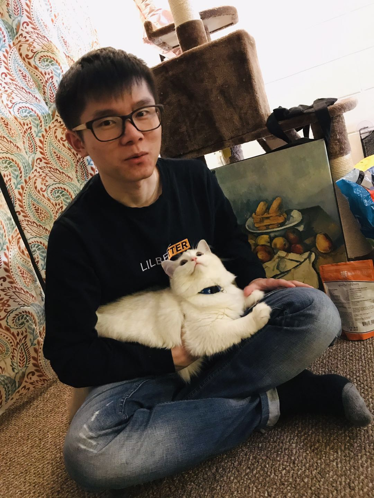

---
# Feel free to add content and custom Front Matter to this file.
# To modify the layout, see https://jekyllrb.com/docs/themes/#overriding-theme-defaults

layout: home
---

My name is Linhua Wang, and I prefer to be called Alex if you are not able to pronounce Mandarin. I enjoy hotpot, noodles, fried rice, bbq, .... hmm, all kinds of food. I play video games, watch movies and do road trips during my leisure time. 

From career perspective, I like researching computational biology which is an interdiscpline involving computer science, biology and mathematics. My professional goal is to build a 'geological map' of human body (GMHB) so that human health can be viewed integratively from diverse perspectives. I believe it can improve our understanding of diseases and help treatments. Just like how google map tells us which route from one place to another is better in terms of time consuming or tolls, eventually, such a GMHB system might be able to tell the optimal treatments needed for a specific pateint in certain circumstances. I'll start my PhD study this Fall.

In this blog, I will post my study notes, solutions to technical issues, good or bad memories and etc. Email me if you find anything interesting or useful. &#9786;   

